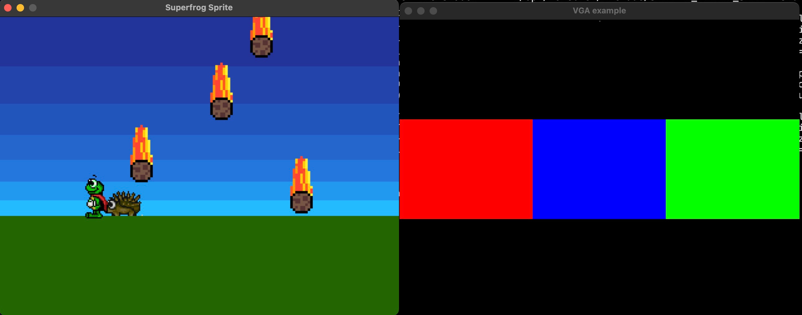

# SuperFrog
VGA lab for EITF35



## Requirements

To build the simulations, you need:

1. C++ Toolchain (clang, gcc)
2. Verilator
3. SDL

Directory structure below.
```shell
├── README.md
├── SuperFrog
│   ├── Nexys7
│   │   ├── HDL files
│   └── Verilator
│       ├── Makefile
│       ├── main_superfrog.cpp
│       └── top_superfrog.sv
└── vga_example
    ├── Nexys7
    │   ├── main.xdc
    │   ├── vga.v
    │   └── vga_tb.v
    └── Verilator
        ├── Makefile
        ├── main_vga.cpp
        └── top_vga.sv
```

Just run make all in the Verilator directory.
Binary need to be run from the Verilator directory due to static paths.

```shell
./sim/superfrog
```

### Installing dependencies

#### Debian derivatives

```shell
apt install verilator libsdl2-dev
```

#### macOS

```shell
brew install verilator sdl2
```

#### Windows

Good luck, see [Lazy Foo' - Setting up SDL on Windows](https://lazyfoo.net/tutorials/SDL/01_hello_SDL/windows/index.php).

## Technical details

Verilator generates C++ code from SV code that simulates your design.
It writes out the digital logic as a set of C++ classes.
All you need to do is provide a thin C++ wrapper that calls these classes to perform the simulation (i.e. send a clock to the top module).

#### Sources & Useful links
[Verilog Simulation with Verilator and SDL](Verilog Simulation with Verilator and SDL).
[CXXRTL, a Yosys Simulation Backend](https://tomverbeure.github.io/2020/08/08/CXXRTL-the-New-Yosys-Simulation-Backend.html#cxxrtl-a-new-simulation-backend)
[VGA controller simulation with verilator](https://ktln2.org/2020/05/24/vga-controller-simulation/).
[Connecting to Verilated Models](https://verilator.org/guide/latest/connecting.html).
